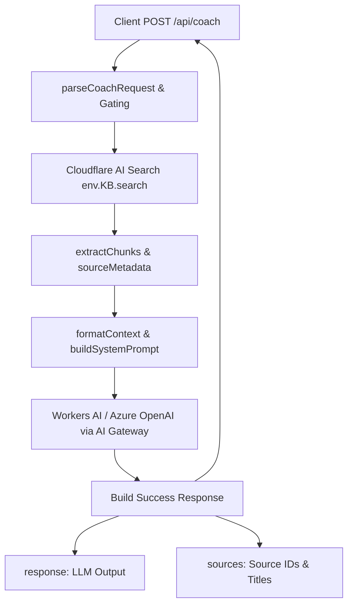

# Spec: Phase 2 — Source-Grounded Retrieval and Safety Behavior

## Overview
Phase 2 turns the Phoenix Coach into a source-grounded and physiologically safe athletic trainer. The goal is two-fold:
1. **Source Grounding (R5 & R6):** Ensure all Vitruvian Trainer product claims, training modes, and digital capabilities are strictly backed by retrieved Knowledge Base (KB) context. If context is missing, the Coach must express uncertainty and refuse to speculate.
2. **Safety Behavior (R7):** Implement robust safety guardrails. Under no circumstances should the Coach diagnose injuries, provide medical treatments, or encourage extreme/unsafe practices (like starving diets or dangerous training regimes). Unsafe requests must trigger conservative disclaimers.

All seed KB files will be updated with traceable metadata and medical disclaimers, and the Cloudflare Worker runtime will be hardened to return safe source metadata alongside its completion.

---

## Requirements

| ID | Description | Priority | Acceptance Criteria |
|----|-------------|----------|-------------------|
| **R5** | Return an answer plus source metadata from retrieved AI Search chunks in the main response payload without exposing raw sensitive prompts. | Must | Success response includes a `sources` array listing `id` and `source` name, but does not output raw chunk text or prompts outside trusted debug mode. |
| **R6** | Keep Vitruvian-specific claims grounded in retrieved KB context. Refuse or caveat claims when retrieved context is absent. | Must | The system prompt strictly directs the LLM to deny or state uncertainty on Vitruvian hardware/features if matching context is not present in retrieved chunks. |
| **R7** | Strengthen safety behavior for pain, injury symptoms, medical limitations, nutrition red flags, and unsafe training requests. | Must | Input triggers (pain, injury, chest pain, starving, unsafe supplement intake) force a polite, conservative guidance response, a clear medical disclaimer, and refusal of unsafe routines. |

---

## Architecture


### Key Decisions
| Decision | Choice | Rationale | Alternatives Considered |
|----------|--------|-----------|----------------------|
| **Sources payload location** | Expose a top-level `sources` array in the main response JSON. | Client frontends need to display source attribution (e.g. "Source: Membership Features") to verify trust without needing debug credentials. | Inside the `response` text as Markdown links (fragile, hard to parse for client UIs). |
| **Medical disclaimer placement** | Inject a standard medical disclaimer at both the KB document level and inside the Worker's system prompt instructions. | Multi-layered defense. Ensures that if a chunk is retrieved, it carries a disclaimer, and the system prompt reinforces this rule for all generation. | Only in the system prompt (high risk if the prompt suffers from attention loss). |
| **Grounding Enforcement** | Strict negative constraints in the system prompt for product-specific facts. | LLMs naturally try to please users and will hallucinate specs (e.g. max load limit) if they think they know it. Forcing a clear "I do not have access to that file" is safer. | Post-retrieval regex checks (too rigid, fails on semantic synonyms). |

---

## API and Type Contracts
Adding the backward-compatible `sources` field to `POST /api/coach`.

### Response Payload Structure (Success 200 OK)
```json
{
  "response": "Based on the Vitruvian membership tiers, the Flame tier provides standard data analytics...",
  "sources": [
    {
      "id": "membership-features",
      "source": "Vitruvian Membership Features"
    }
  ]
}
```

### Modified Types in `src/index.ts`
```typescript
interface CoachResponsePayload {
  response: string;
  sources: Array<{ id: string; source: string; score?: number }>;
  debug?: JsonObject;
}
```

---

## File Placement

| Artifact | Path | Placement Rationale | Existing Pattern |
|----------|------|---------------------|------------------|
| **Worker Implementation** | `src/index.ts` | Central fetch handler, prompt assembly, and RAG execution. | Single-module index layout. |
| **Nutrition Knowledge** | `kb/nutrition/nutrition-basics.md` | Contains basic calorie/macro targets. | Standard seed KB format. |
| **Programming Knowledge** | `kb/programming/hypertrophy-principles.md` | Hypertrophy volume/rest rules. | Standard seed KB format. |
| **Safety Knowledge** | `kb/safety/safety-boundaries.md` | Setup and spotting limits. | Standard seed KB format. |
| **Membership Knowledge** | `kb/vitruvian/membership-features.md` | Vitruvian subscription tiers. | Standard seed KB format. |
| **Cap/Calib Knowledge** | `kb/vitruvian/strength-assessment-weight-cap.md` | Physical cable limits and display multipliers. | Standard seed KB format. |
| **Modes Knowledge** | `kb/vitruvian/training-modes.md` | Motor enums (OLD_SCHOOL, TUT, etc.). | Standard seed KB format. |
| **Validation Tests** | `tests/phase2-retrieval-safety.test.mjs` | Automated unit/contract tests for retrieval formatting and safety prompt rules. | Node.js test module convention. |

---

## Path Validation
**Status:** All paths valid successfully.

| Deliverable | Path | Category | Valid | Notes |
|-------------|------|----------|-------|-------|
| `src/index.ts` | `src/index.ts` | routes/services | Yes | Matches `src` primary mapping. |
| KB Files | `kb/**/*.md` | docs | Yes | Matches `kb` primary mapping. |
| Verification Tests | `tests/phase2-retrieval-safety.test.mjs` | tests | Yes | Matches `tests` category pattern. |

---

## Data and Control Flow
1. **Client** dispatches `POST /api/coach` with `{ message: "Is TUT mode good for hypertrophy?" }`.
2. **Worker** validates the message size, sanitizes parameters.
3. **Worker** queries `env.KB.search` with hybrid/RRF settings.
4. **Worker** parses response:
   - Loops through chunks and normalizes them via `normalizeChunk()`.
   - Generates safe `sources` metadata (e.g. `[{ id: "training-modes", source: "Vitruvian Training Modes" }]`).
   - Builds `contextString` of chunk texts.
5. **Worker** builds `systemPrompt` which contains the strict grounding rules and medical disclaimers.
6. **Worker** calls LLM Gateway.
7. **Worker** extracts completion string, constructs final payload `{ response, sources }`.
8. **Client** receives payload.

---

## Compatibility Constraints
- The `sources` key is a brand-new field. Clients who ignore it will still read `response` normally. No existing clients will break.
- Local tests and wrangler env are fully compatible with this schema.

---

## Failure Modes

| Failure Mode | Expected Behavior | Verification |
|--------------|-------------------|--------------|
| **AI Search fails or times out** | Log error, format fallback context `No relevant articles retrieved from the knowledge base.`, and LLM continues with fallback context (which triggers grounding safety rules). | Test by stubbing or failing search call in unit tests. |
| **Empty search results** | Return an empty `sources: []` array, and system prompt causes the LLM to politely state it cannot confirm Vitruvian details. | Test with query unrelated to Vitruvian. |
| **Dangerous supplement/pain request** | LLM output must refuse to plan, must provide a firm medical disclaimer, and steer back to safety. | Assert output matches key warning terms in safety tests. |

---

## Acceptance Checks

| Check | Command or Evidence | Required |
|-------|---------------------|----------|
| **Typecheck** | `npm run typecheck` | true |
| **Phase 1 Contracts** | `npm run test:contracts` | true |
| **Phase 2 Tests** | `node --test tests/phase2-retrieval-safety.test.mjs` | true |

---

## Deliverables

### D1: Standardized KB Frontmatter & Disclaimers
- **Path:** `kb/**/*.md`
- **Purpose:** Provide seed context that includes source traceability metadata and explicit disclaimers.
- **Key Content:**
  - Standard YAML frontmatter with `title`, `source`, `version`, and `disclaimer` fields.
  - Standard footer: *Disclaimer: This document is for general coaching and educational purposes only. It is not medical advice.*

### D2: Source Metadata Extraction and Payload Injection
- **Path:** `src/index.ts`
- **Purpose:** Expose retrieved metadata as a safe `sources` array in the main success response.
- **Key Content:**
  - `sources` is populated by mapping the normalized chunks to `{ id, source, score }`.
  - Main fetch handler merges `sources` into the final response JSON.

### D3: Grounding and Safety Prompt Gating
- **Path:** `src/index.ts`
- **Purpose:** HARDEN the Coach against hallucinating product details and mandate medical disclaimers on sensitive inputs.
- **Key Content:**
  - Precise grounding instructions (R6): Refuse product specs or claims if NOT present in the retrieved context.
  - Precise safety instructions (R7): Trigger a clear disclaimer and redirect to qualified professionals if the user mentions pain, chest pain, injury, extreme diet (<1200 kcal), or unsafe supplements (e.g. DNP, clenbuterol).

### D4: Phase 2 Verification Suite
- **Path:** `tests/phase2-retrieval-safety.test.mjs`
- **Purpose:** Verify prompt construction, grounding rules, metadata parsing, and safety enforcement via mock tests.
- **Key Content:**
  - Mock checks for `extractChunks` and `sourceMetadata` shapes.
  - Tests validating that system prompt contains strict safety instructions, medical warnings, and grounding rules.

---

## Open Questions

| # | Question | Impact | Default Chosen by Spec | Planning Effect |
|---|----------|--------|------------------------|-----------------|
| 1 | Should we expose chunk scores to the client in the `sources` field? | Non-blocking | Yes, optionally expose `score` if available in the chunk object from AI Search. | Included in types as an optional property. |

---

## Complexity Assessment

**Rating:** Complex

| Metric | Value |
|--------|-------|
| Requirements | 3 (R5, R6, R7) |
| Deliverables | 8 (7 KB modifications + 1 code modification + 1 test file) |
| Estimated waves | 2 |
| Estimated plans | 3 |
| Competing proposals | Recommended |

**Rationale:** Exposing a coaching service that discusses physiological safety and physical equipment requires highly reliable prompting and robust verification. Overlooking medical disclaimers or allowing product hallucinations creates massive liability, making this a complex design phase.

**Recommended next step:** Proceed to competing architecture proposals to evaluate trade-offs in grounding implementation.
